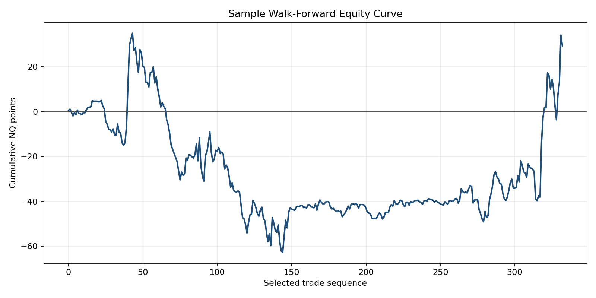

# BTC/NQ ML Strategy

This repository contains a reproducible research workflow for a cross-asset intraday strategy using Bitcoin futures context to filter NASDAQ-100 futures signals.

The project is intentionally conservative in its claims. It shows how to build point-in-time features, label baseline trade outcomes, run chronological walk-forward validation, and audit for common leakage paths. It is not presented as a production trading system.

## Portfolio Note

This is a curated public version of a larger machine-learning coursework project. The local research archive included exploratory notebooks, alternative model trials, large CSV files, and scratch outputs. The public repository keeps only the material needed to inspect the methodology.

## What This Project Is

- A Python time-series workflow for synchronized one-minute BTC/NQ data.
- A baseline rule that enters NQ when BTC and NQ candle direction aligns.
- A machine-learning filter that decides whether to accept or reject baseline trade candidates.
- A leakage-aware validation example using chronological splits and rolling walk-forward windows.
- A compact portfolio artifact with tests, sample data, notebooks, and generated outputs.

## What This Project Is Not

- It is not financial advice.
- It is not a live execution engine.
- It is not a claim of stable alpha.
- It does not model slippage, commissions, exchange outages, latency, funding, margin, or order-book constraints.
- It does not include the full proprietary/local research archive or full raw data files.

## Methodology

The strategy studies whether BTC/NQ intraday alignment contains useful context for filtering NQ trades.

1. Load BTC and NQ OHLCV bars.
2. Synchronize both markets on a common one-minute timestamp calendar.
3. Build point-in-time features from current and historical bars only.
4. Generate baseline trade candidates when BTC and NQ candle directions align.
5. Label each candidate using its future realized NQ PnL.
6. Train classifiers only on past labeled candidates.
7. Select thresholds only on the training window.
8. Apply the trained model and selected threshold to the next chronological window.

The model predicts whether a baseline signal should be accepted. It does not directly predict the unconditional next NQ return.

## Leakage Controls

The repository includes explicit guards against common leakage mistakes:

- `pnl`, `target`, `exit_idx`, forward returns, and future-looking columns are rejected from model features.
- `StandardScaler` is fitted inside each training window only.
- Walk-forward test windows occur strictly after their training windows.
- Threshold selection uses training-window predictions and historical outcomes only.
- Overlapping trades are filtered so an active position cannot be double-counted.

These controls are tested in `tests/`.

## Results Snapshot

The bundled sample is a small synchronized slice of the local data and is used for reproducibility checks. It should not be treated as a statistically meaningful backtest.

Current sample smoke-run metrics:

| Metric | Value |
| --- | ---: |
| Selected trades | 333 |
| Total PnL, NQ points | 29.39 |
| Average PnL, NQ points | 0.0883 |
| Win rate | 40.84% |
| Max drawdown, NQ points | -97.66 |
| Sharpe-like trade ratio | 0.0214 |

The weak Sharpe-like ratio and large drawdown are part of the result. They are not hidden or reframed as a production-quality edge.



## Repository Layout

```text
.
|-- .github/
|   `-- workflows/ci.yml
|-- .dockerignore
|-- data/
|   `-- sample/
|       |-- btc_1m_sample.csv
|       `-- nq_1m_sample.csv
|-- notebooks/
|   |-- 01_data_exploration_and_baseline.ipynb
|   `-- 02_modeling_walk_forward.ipynb
|-- outputs/
|   |-- figures/
|   `-- tables/
|-- scripts/
|   |-- clean_notebooks.py
|   `-- smoke_run.py
|-- src/
|   |-- backtest.py
|   |-- data.py
|   |-- features.py
|   |-- labels.py
|   `-- validation.py
|-- tests/
|-- Dockerfile
|-- Makefile
|-- requirements.txt
`-- README.md
```

## Reproducibility Quickstart

Python 3.11 is the CI and Docker baseline. The local development run used a newer Python interpreter as well.

```bash
python -m pip install -r requirements.txt
make check
```

On Windows without `make`, run:

```powershell
python -m pytest
python scripts/smoke_run.py
```

The smoke run writes:

- `outputs/tables/sample_smoke_metrics.csv`
- `outputs/tables/sample_selected_trades.csv`
- `outputs/figures/sample_walk_forward_equity.png`

## Docker

```bash
docker build -t cliprob/btc-nq-ml-strategy:check .
docker run --rm cliprob/btc-nq-ml-strategy:check
```

## Data Notes

The public repository includes only a small sample dataset. Full local CSV files are excluded from Git because they are large and because market-data redistribution terms must be respected.

Data sources used in the underlying project:

- BTCUSDT futures one-minute OHLCV from Binance Futures public klines.
- NASDAQ-100/NQ proxy one-minute OHLCV from a local Duka-based collection workflow.

The sample is included only to make the code path inspectable. Re-running a full study requires independently obtaining data with appropriate permissions and then using the same OHLCV schema:

```text
time,open,high,low,close,volume
```

`time` may be Unix seconds or a parseable timestamp string.

## Assumptions and Limitations

- BTC and NQ bars are joined by exact timestamp intersection.
- The baseline enters on the bar after the aligned signal candle.
- Labels use future realized PnL; features do not.
- Results are sensitive to trading session, data vendor, calendar alignment, and market regime.
- The sample does not include transaction costs or slippage.
- The workflow is suitable for methodological review, not deployment.

## Skills Demonstrated

- time-series data cleaning and synchronization,
- feature engineering with point-in-time constraints,
- classification framing for trade filtering,
- chronological walk-forward validation,
- leakage-aware testing,
- reproducible Python project packaging for a public quant portfolio.
